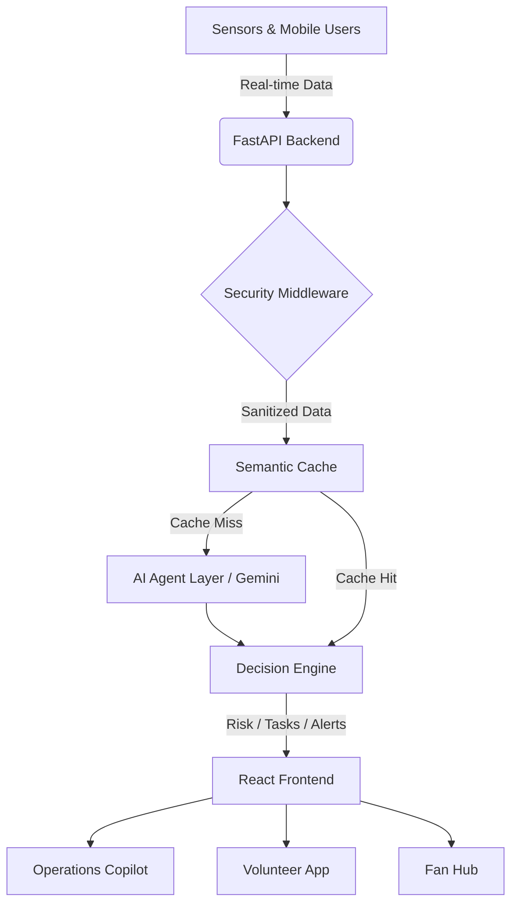

# Architecture Overview

NexusGuard features a decoupled, scalable architecture separating the high-performance React frontend from the intelligent Python FastAPI backend.

## Overall System Architecture

## Data Flow & AI Workflow
1. **Sensor Data**: Hardware sensors and user inputs stream into the backend APIs.
2. **Risk Detection**: Basic heuristics trigger anomaly workflows.
3. **Security**: Data passes through `sanitizer.py` to strip PII.
4. **AI Analysis**: The generative AI agents (via Google Gemini) process the anomalous data to predict future state.
5. **Recommendation**: The Decision Engine formats actionable intelligence for stadium operators.
6. **Volunteer Dispatch**: Tasks are automatically synthesized and delegated to nearby staff.
7. **Multilingual Alerts**: PA announcements are dynamically generated and translated for different crowd segments.

## Semantic Caching
To ensure sub-second response times and reduced LLM operational costs, NexusGuard utilizes a **Semantic Cache**. 
When a request is made, the backend computes the semantic embedding of the query and checks the cache for similar historical inquiries. If similarity > 95%, it serves the cached response instantly, bypassing the LLM entirely.

The application follows a modern, decoupled architecture designed for high throughput, real-time updates, and AI-driven predictive operational intelligence.

### High-Level Architecture
1. **Frontend**: React 19 (Vite) + Tailwind CSS + Framer Motion.
2. **Backend**: FastAPI (Python) with asynchronous task handling.
3. **AI Layer**: Real Google Gemini Integration with mocked fallbacks, `tenacity` retries, and strict output parsing.
4. **Caching & Real-Time**: WebSocket and SSE integration with in-memory semantic LRU caching.
5. **Security**: PyJWT-based authentication and `slowapi` rate limiting.

## Frontend Architecture
- **Vite & React**: Fast build times and optimized rendering.
- **Zustand**: Lightweight global state management (Theme, User Roles, Settings).
- **Tailwind CSS**: Utility-first CSS ensuring perfectly consistent design tokens for Light/Dark themes.
- **Framer Motion**: Fluid, hardware-accelerated micro-animations.

## Backend Architecture
- **FastAPI**: Asynchronous Python framework optimized for high throughput.
- **Pydantic**: Strict data validation and type serialization.
- **Gemini API**: Generative AI core for intelligence and predictions.
