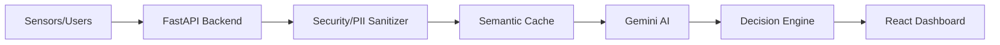

# NexusGuard – AI Stadium Operations Copilot

*The ultimate intelligent operations platform for the FIFA World Cup 2026, powered by Generative AI.*

[](#)
[](#)
[](#)
[](#)
[](#)
[](#)
[](#)
[](#)
[](#)

## 🏆 Project Description

NexusGuard is a proactive **AI Stadium Operations Copilot** designed for the **Google Prompt Wars Virtual Challenge** (Focusing on the FIFA World Cup 2026). 

**The Problem:** Managing a 80,000+ seat stadium involves analyzing thousands of data points—crowd density, medical emergencies, staff positioning, and fan queries. Traditional dashboards are reactive, forcing operators to manually parse data to find issues.

**The Solution:** NexusGuard flips the paradigm. Instead of humans monitoring dashboards, **AI monitors the stadium**. It predicts bottlenecks before they occur, explains its reasoning, automatically dispatches volunteers, and seamlessly assists global fans in multiple languages.

**Why Generative AI?** Traditional algorithms can trigger a simple threshold alert, but Generative AI contextualizes complex, overlapping situations (e.g., "A medical alert near Gate 4 during halftime rush"), formulates mitigation plans, translates alerts instantly, and provides natural-language summaries for operators.

---

## ✨ Key Features

| Feature | Description |
|---|---|
| 🧠 **AI Operations Copilot** | Proactively analyzes stadium metrics and predicts crowd risks. |
| 🗺️ **Crowd Intelligence** | Real-time SVG-based visualization of stadium density and flow. |
| 🛡️ **Incident Management** | Automated logging, AI reasoning, and mitigation recommendations. |
| 🏃 **Volunteer Dispatch** | Smart task delegation with geolocation routing for staff. |
| 🌍 **Fan Assistance** | Multilingual AI concierge assisting fans instantly in their native languages. |
| ♿ **Accessibility** | Full Light/Dark theme support, reduced motion, WCAG compliance. |
| 🔒 **Privacy Protection** | Middleware sanitization ensuring zero PII reaches the LLM. |
| ⚡ **Semantic AI Cache** | Bypasses LLM generation for similar queries to ensure sub-second speed. |
| 💻 **Responsive Dashboard**| Enterprise-grade UI optimized for all devices and operations centers. |

---

## 🏗️ Architecture & Data Flow

NexusGuard relies on a highly decoupled architecture separating visual rendering from AI logic.



### Tech Stack

| Layer | Technology |
|---|---|
| **Frontend** | React, TypeScript, Vite, Tailwind CSS, Zustand, Framer Motion |
| **Backend** | Python, FastAPI, Pydantic, Uvicorn |
| **Database** | In-Memory LRU Cache (Prototype) / Redis (Planned for Prod) |
| **AI** | Google Gemini API, Semantic Embeddings |
| **Testing** | Pytest (Backend), ESLint/TypeScript (Frontend) |
| **Deployment** | Netlify (Frontend), Render (Backend) |

---

## 📁 Folder Structure

```
NexusGuard/
├── backend/
│   ├── ai/               # Gemini AI Prompts & Agents
│   ├── api/              # FastAPI Routers & Middleware
│   ├── db/               # Database Schemas
│   ├── services/         # Incident, Cache, & Logic Services
│   ├── tests/            # Pytest Suite
│   ├── main.py           # Application Entrypoint
│   └── requirements.txt  # Python Dependencies
├── frontend/
│   ├── src/
│   │   ├── assets/       # Static assets (images, fonts)
│   │   ├── components/   # React UI Components
│   │   ├── data/         # Mock data and configurations
│   │   ├── hooks/        # Custom React Hooks
│   │   ├── layouts/      # Dashboard & App Layouts
│   │   ├── pages/        # Main Application Views
│   │   ├── services/     # API Integration Services
│   │   ├── store/        # Zustand State Management
│   │   ├── styles/       # Tailwind & Global CSS
│   │   ├── types/        # TypeScript Interfaces and Types
│   │   └── utils/        # Helper and utility functions
│   ├── package.json      # Node Dependencies
│   └── vite.config.ts    # Vite Configuration
├── .github/              # CI/CD Workflows
├── API.md                # API Documentation
├── ARCHITECTURE.md       # System Design Specs
├── DEPLOYMENT.md         # Deployment Guide
├── SECURITY.md           # Security & AI Threat Model
└── README.md             # Project Overview
```

---

## 🚀 Installation & Setup

### Prerequisites
- Node.js (v18+)
- Python 3.10+
- Google Gemini API Key

### 1. Clone the Repository
```bash
git clone https://github.com/ekjot9105-commits/NexusGuard.git
cd NexusGuard
```

### 2. Install Frontend
```bash
cd frontend
npm install
```

### 3. Install Backend
```bash
cd ../backend
python -m venv venv
source venv/bin/activate  # (Windows: venv\Scripts\activate)
pip install -r requirements.txt
```

---
## 🏃 Running the Project

### Development Mode

**Start the Backend:**
```bash
cd backend
uvicorn main:app --reload --port 8000
```

**Start the Frontend:**
```bash
cd frontend
npm run dev
```

### Production Build
```bash
cd frontend
npm run build
# Serve the /dist folder using any static server (e.g., serve, nginx)
```

## 🌐 API Overview

Documented extensively in [API.md](API.md).

| Method | Route | Purpose | Expected Request | Expected Response |
|---|---|---|---|---|
| `POST` | `/api/v1/copilot/predict` | Generate AI predictions for crowd flow. | `{ crowd_density: 85 }` | `{ risk_score: 75, recommendation: "..." }` |
| `GET`  | `/api/v1/dashboard/kpi` | Retrieve real-time metrics. | `None` | `{ crowdDensity: 82, volunteers: 45 }` |
| `POST` | `/api/v1/fan/concierge` | Multilingual fan Q&A. | `{ message: "..." }` | `{ reply: "...", language: "es" }` |

---

## 🧠 AI Workflow

The AI workflow operates as a proactive continuous pipeline:

1. **Sensor Data** (Crowd metrics, tickets scanned)
   ↓
2. **Risk Detection** (Heuristics flag anomalies)
   ↓
3. **AI Analysis** (Gemini analyzes context and historical data)
   ↓
4. **Recommendation** (Decision engine formulates mitigation)
   ↓
5. **Volunteer Dispatch** (Tasks automatically assigned to nearest staff)
   ↓
6. **Multilingual Alerts** (PA announcements generated in required languages)

---

## 🔒 Security Features

Detailed in [SECURITY.md](SECURITY.md).

- **PII Sanitization**: Custom middleware strips personal data before LLM processing.
- **Prompt Injection Protection**: Strict input validation via Pydantic and bounded system prompts.
- **Rate Limiting**: Throttling to prevent API abuse and control token spend.
- **Validation**: Rejection of malformed requests.
- **Authentication**: Role-based JWT access.
- **Caching**: Semantic cache to prevent redundant LLM queries and data leaks.

---

## ⚡ Performance Optimizations

- **Semantic Cache**: Reduces API calls and returns instant responses for similar queries.
- **Async FastAPI**: High-concurrency throughput for concurrent operator requests.
- **Lazy Loading**: React components (`Suspense`) loaded only when navigating to specific dashboards.
- **Code Splitting**: Vite optimization for small bundle sizes.
- **Memoization**: Efficient React rendering using `useMemo` and `useCallback`.
- **Optimized Rendering**: CSS transform-based hardware-accelerated animations (Framer Motion).

---

## ♿ Accessibility

NexusGuard adheres to **WCAG 2.2 AA** standards:
- High contrast Light and Dark semantic themes.
- Reduced Motion toggle for users with vestibular disorders.
- Aria-labels for all interactive graphs and maps.
- Keyboard-navigable tabular data and modal traps.

---

## 🧪 Testing

- **Backend Tests**: `pytest` for unit testing the FastAPI routes and services.
- **Frontend Tests**: Full static analysis via `oxlint` and TypeScript strict mode.
- **How to run**: `cd backend && pytest tests/`
- **Coverage**: Focus on security middleware and core AI routing logic.

---

## 🚀 Deployment

Detailed in [DEPLOYMENT.md](DEPLOYMENT.md).

- **Frontend**: Seamlessly deployed on **Netlify** with continuous integration from the `main` branch.
- **Backend**: Hosted on **Render** (or AWS/GCP for scaling) configured with Gunicorn/Uvicorn workers.

---

## 🔮 Future Improvements

- Transition to WebSockets for sub-second, real-time KPI streaming instead of HTTP polling.
- Introduce React Native wrappers for the Volunteer Dashboard to leverage native push notifications.
- Implement Edge-deployed Semantic Caching for ultra-low global latency.

---

## 🤝 Contributing

Read our [Contribution Guidelines](CONTRIBUTING.md) to get started!

---

## 📄 License
This project is licensed under the [MIT License](LICENSE).

---

## 🙏 Acknowledgements
- Developed for the **Google Prompt Wars Virtual Challenge**.
- Powered by tools from **Google for Developers**.
- Hosted and supported by **Hack2Skill**.
